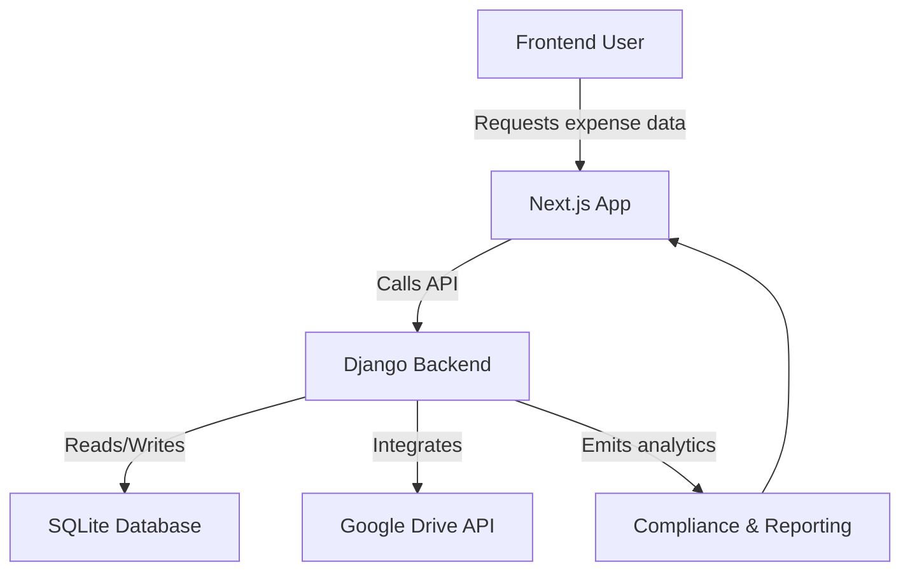

# Expense AI Monorepo

## 📖 Overview

Expense AI is a polished full-stack expense management solution designed for finance teams, small businesses, and developers exploring AI-enhanced accounting workflows. The repository combines a Django backend API with a modern Next.js frontend to deliver a secure, scalable, and extensible expense tracking experience.

This project emphasizes rapid development, modular architecture, and AI-enabled insights for expense categorization, compliance monitoring, and analytics.

## 🎯 Features

- Intelligent expense tracking with AI-supported analysis
- Responsive web dashboard built with Next.js and React
- Django REST backend with API-first design
- Google Drive integration for receipt import and document storage
- Budget and compliance monitoring endpoints
- Local development support with SQLite and configurable production-ready persistence

## 🛠️ Tech Stack

| Layer | Technology | Role |
|---|---|---|
| Backend | Python, Django, Django REST Framework | API, business logic, data persistence |
| Frontend | Next.js, React, TypeScript | UI, client routing, interactive dashboards |
| Database | SQLite (development) | lightweight local persistence |
| Devops | Procfile, `.env` conventions | local service orchestration |
| Cloud Integrations | Google Drive API | receipt upload and storage automation |

## 🚀 Getting Started

### Prerequisites

- Node.js 18+ and npm
- Python 3.8+ and pip
- Git
- Recommended: Python virtual environment support

### Installation

Clone the repository:

```bash
git clone https://github.com/<your-org>/expense-ai.git
cd "c:\Users\genpr\Documents\Professional Documents\Lifewood Documents\Lifewood_Ai-Agent-V4"
```

#### Backend Setup

```powershell
cd expense-ai-backend
python -m venv .venv
.\.venv\Scripts\Activate.ps1
pip install -r requirements.txt
```

Create or configure environment variables using a `.env` file. Example values may include:

```text
DJANGO_SECRET_KEY=change-me
DEBUG=True
DATABASE_URL=sqlite:///db.sqlite3
GOOGLE_OAUTH_CREDENTIALS=expense_ai/credentials.json
OPENAI_API_KEY=your_key_here
```

Run database migrations:

```powershell
python manage.py migrate
```

Launch the backend server:

```powershell
python manage.py runserver
```

The backend API is available at `http://127.0.0.1:8000`.

#### Frontend Setup

```powershell
cd ../expense-ai-frontend
npm install
```

Configure frontend environment values as needed in `.env.local` or via environment variables:

```text
NEXT_PUBLIC_LOCAL_API_URL=http://localhost:8000
NEXT_PUBLIC_API_URL=
NEXT_PUBLIC_REMOTE_API_URL=
```

Start the Next.js development server:

```powershell
npm run dev
```

The frontend is available at `http://localhost:3000`.

### Run Locally

1. Start the backend service first.
2. Start the frontend service.
3. Open the app at `http://localhost:3000`.

## 📂 Project Structure

```text
.
├── expense-ai-backend/
│   ├── admin_users/
│   │   ├── models.py
│   │   ├── views.py
│   │   └── urls.py
│   ├── billing/
│   │   ├── analytics_views.py
│   │   ├── models.py
│   │   └── security/
│   │       ├── pipeline.py
│   │       └── monitoring.py
│   ├── expense_ai/
│   │   ├── settings.py
│   │   ├── urls.py
│   │   └── wsgi.py
│   ├── google_drive/
│   │   ├── views.py
│   │   └── utils.py
│   ├── db.sqlite3
│   ├── manage.py
│   └── requirements.txt
├── expense-ai-frontend/
│   ├── public/
│   ├── src/
│   │   ├── app/
│   │   ├── components/
│   │   └── lib/
│   ├── package.json
│   └── tsconfig.json
└── README.md
```

## 📸 Visual Workflow Diagram



## 📈 Benchmarks & Performance

- Local development with SQLite is optimized for rapid iteration and low setup overhead.
- Production deployments should use a managed RDBMS and asynchronous worker architecture for data-heavy workloads.
- Frontend performance is enhanced by Next.js SSR/SSG capabilities and minimal bundle size.
- Backend API latency is primarily impacted by database performance, external API calls, and server concurrency configuration.

> Note: benchmark values depend on deployment environment, dataset size, and infrastructure choices.

## 🧪 Testing

### Backend tests

```powershell
cd expense-ai-backend
.\.venv\Scripts\Activate.ps1
pytest
```

### Frontend tests

If unit or integration tests exist in `expense-ai-frontend`, run:

```powershell
cd expense-ai-frontend
npm test
```

### Recommended test strategy

- Validate API endpoints with Django tests
- Use component tests for React UI behaviour
- Perform end-to-end checks for authentication and expense workflows

## 📜 License

This project should include a license file such as `LICENSE` to define permitted usage. If no license is present, please add one before publishing.

## 🤝 Contributing

Thank you for considering contributions. To contribute:

1. Fork the repository or create a feature branch.
2. Open an issue describing the enhancement or bug fix.
3. Submit a pull request with a clear description and testing notes.
4. Keep changes modular and document configuration updates.

### Contribution expectations

- Use consistent naming and code style across backend and frontend
- Keep secrets out of source control
- Ensure both services start and communicate in local development

## 📧 Contact / Support

For questions, feedback, or support, please open an issue in this repository.

If you prefer direct contact, add your preferred email or Slack channel here for team collaboration.

